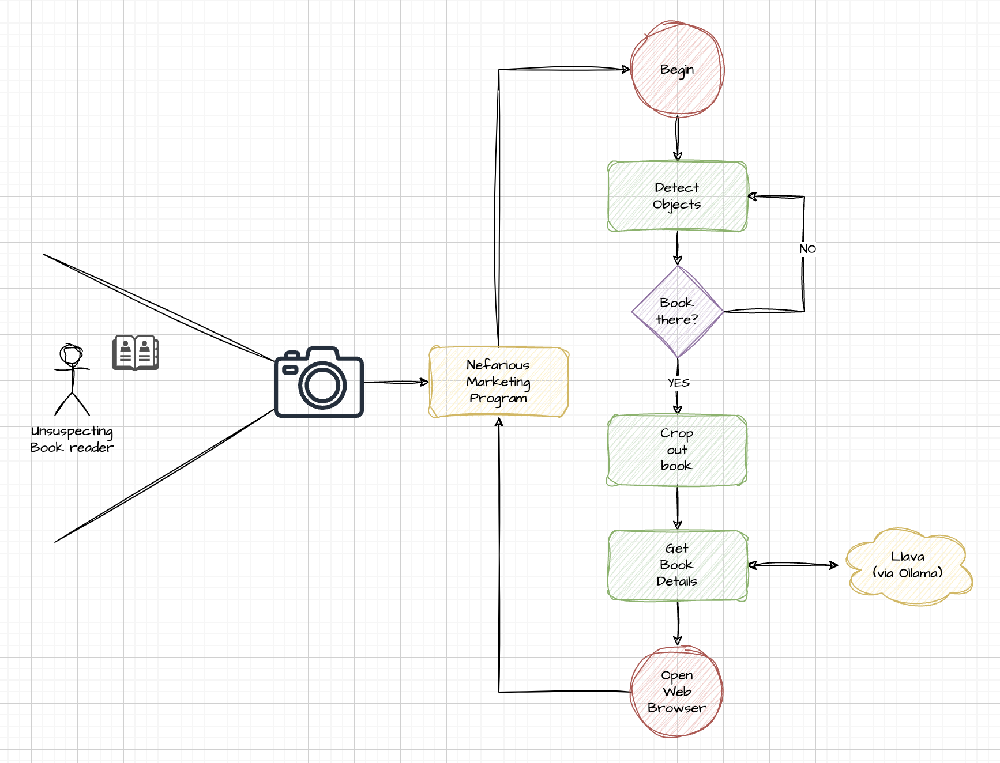

# LIGHT SURVEY OF IMAGE/VISUAL AI #
Presented By: Steve Brettschneider (CVG)

## Synopsis ##
There are a myriad of graphic/image AI technologies available for image processing
and generation.  Here are a few that I've been playing with:

* [ImageAI (Python)](https://github.com/OlafenwaMoses/ImageAI) - Will use the
  Yolo-v3-based models to detect objects.  You can train existing models to be
  able to detect your own objects.
* [Llava](https://www.microsoft.com/en-us/research/project/llava-large-language-and-vision-assistant/) -
  A multi-modal model (that you can easily run via [Ollama](https://ollama.com)).  Allows you to present
  an image as part of a LLM-type chat prompt.  You can ask the model questions about the image. (i.e.
  "Do the people in this picture look happy?")
* [Google Tesseract](https://github.com/tesseract-ocr/tesseract) - An OCR engine that will convert images
  that contain text into text-strings.  Written in C++, but there's a handy Python package called
  [Pytesseract](https://pypi.org/project/pytesseract/) that makes working with it a breeze.
* [StableDiffusion](https://github.com/Stability-AI/StableDiffusion) - A text-to-image geneartion tool.
  There are many online implementations, but you can run it locally on your own hardware.  It's API based,
  so you send a REST request to it, and it generates and returns an image.  For easier use, I use a UI on
  top of my local install called [DifffusionBee](https://diffusionbee.com/download).

In this presentation, I use the first two technologies (ImageAI and Llava - along with a couple helper
packages) to  turn on my latop's camera and have it continually search for books.  When it finds a book,
it crops the book out of the image and sends it to Llava to get the details about it (title, author, genre).
It then opens up an Amazon search for that book so you can buy it.

